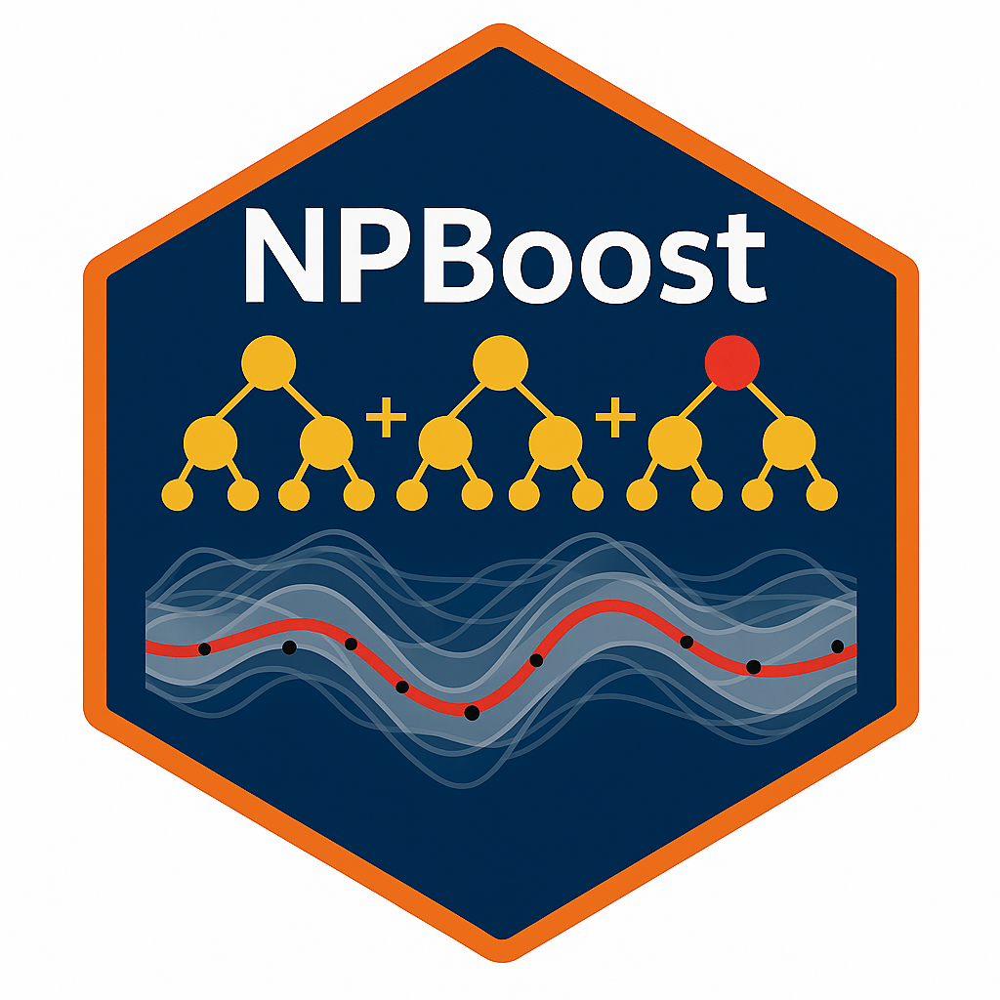

# NPBoost: Neural Process Boosting

This repository contains the code to replicate the results presented in our paper _NPBoost: Neural Processes with Gradient-Boosted Fixed Effects_.
In particular, this repository contains the implementation for NPBoost,
a novel algorithm that combines gradient-boosted trees with Neural Processes (NPs) for meta-learning on tabular data.

Meta-learning and mixed-effects models share a hierarchical structure: observations belong to tasks, and tasks are drawn from a common population.
Most extensions of NPs modify the neural network architecture, so that the response is represented entirely by a single context-conditioned model.
With NPBoost we instead change the task decomposition:

**Key Idea**:

NPBoost decomposes each task into fixed effects shared across tasks and random effects capturing stochastic task-to-task variation.

- Capture shared population-level structure using a gradient-boosted tree ensemble (the "boosting" part).
- Model task-specific random effects and quantify uncertainty using a Neural Process, enabling adaptation to a new task from a small context set.
- Train both components jointly, alternating between NP and boosting updates.

**What is in this Repository?**

This repository provides the code and resources to:

- Train and evaluate the NPBoost model.
- Reproduce the experiments from our paper on both synthetic and real-world datasets.
- Compare NPBoost against baselines, including standard and attentive NPs, mixed-effects models, gradient-boosted trees and foundation models (TabICL).
- Reproduce the plots from our paper.

## Getting Started

Follow these steps to set up the project environment and run the experiments.

We ran the experiments on Fedora Linux 43 (x86-64) using Python 3.12.13.
We list details on the hardware in the appendix of our paper.

### 1. Clone the Repository

First, clone this repository to your machine using Git:

```bash
git clone https://github.com/ken-r/npboost.git
cd npboost
```

### 2. Install Dependencies


Create a virtual environment and activate it before installing the dependencies.

```bash
python3 -m venv npboost_env
source npboost_env/bin/activate
```

For regular use, please install the dependencies from ``requirements.txt``:

```bash
pip install -r requirements.txt
```

If you want to recreate the final experiment environment perfectly, install the frozen file instead:

```bash
pip install -r requirements-freeze.txt
```

It is a snapshot of the complete Python environment used for the final experiments.
It pins transitive dependencies and packages that are not listed explicitly in ``requirements.txt``.

For the `spotify` experiments for the GPLinear model, we used a newer version of the GPBoost library that fixed some gradient instabilities.
Its frozen environments are in ``requirements-gpboost-freeze.txt``.

The notebooks live in a separate folder, so please install the project itself to make the ``src`` modules importable from there:

```bash
pip install -e .
```

This is what the ``pyproject.toml`` file is for.

### 3. Fetch and Generate the Data

To create the synthetic datasets, you can run ``scripts/data/generate_data.py`` as a module. In particular, you can run

```bash
python -m scripts.data.generate_data
```

This reads the active Hydra data configuration from ``configs/`` and generates raw and split data. Synthetic data settings live under ``configs/data/synthetic/``. You can change the number of groups, observations per group, feature domain, fixed effect, random effect, noise model, and split sizes there.

For real datasets, see ``DATA.md`` for the source files expected in ``data/source``. The bike dataset is fetched automatically, but its temporal few-shot split needs the extra notebook step described in ``DATA.md``.

The generated data is saved to the ``data`` folder and follows this structure:

```text
data/
|-- source/                         # downloaded source files for real experiments
|   |-- vehicles.csv
|   |-- spotify_songs.csv
|   |-- nlme_Milk.csv
|   |-- SeoulBikeData.csv
|   `-- ...
|-- raw/                            # processed, unsplit parquet files: if synthetic, one dataset for each seed
|   |-- real/
|   |   |-- bike/log_count.parquet
|   |   |-- cars/log_price.parquet
|   |   |-- cows/protein.parquet
|   |   `-- spotify/danceability.parquet
|   `-- synthetic/
|       |-- gp_gaussian/
|       |   |-- steps_1D/seed0.parquet
|       |   |-- steps_1D/seed1.parquet
|       |   `-- steps_2D/seed0.parquet
|       |-- brownian_gaussian/
|       `-- ...
`-- split/                          # task-specific train/validation/test splits, one for each seed
    |-- real/
    |   |-- bike/log_count/few_shot/seed0.parquet
    |   |-- bike/log_count/in_context/seed0.parquet
    |   |-- cars/log_price/few_shot/seed0.parquet
    |   `-- ...
    `-- synthetic/
        |-- gp_gaussian/steps_1D/few_shot/seed0.parquet
        |-- gp_gaussian/steps_1D/in_context/seed0.parquet
        |-- brownian_gaussian/steps_2D/few_shot/seed0.parquet
        `-- ...
```

Here, ``raw/`` stores the processed datasets before task splitting, while ``split/`` stores the corresponding task-specific versions used by the experiment runners. Synthetic datasets are organized by generator, fixed-effect setting, task, and seed. The notebooks in ``notebooks/data/`` explore and visualize the datasets and the synthetic data generation components.

The experiment names used in the code differ from the dataset names used in the paper.
The table below maps between them.

#### Synthetic
Synthetic data is passed by `data=synthetic/{Configuration name}`

| Paper | Configuration name |
| --- | --- |
| `reference` | `gp_gaussian` (passing `steps_1D` and `steps_2D` as fixed effects ) |
| `more-tasks` | `gp_gaussian_very_many_groups` |
| `Brownian` | `brownian_gaussian` |
| `Brownian-LN` | `brownian_lognormal` |
| `irr-feat` | `gp_gaussian_irrelevant_x` |
| `GP-regression` | `gp_gaussian` (passing `zero_1D` and `zero_2D` as fixed effects ) |

#### Real-world
Real-world data is passed by `data=real/{Configuration name}`

| Paper | Configuration name |
| --- | --- |
| `cars` | `cars` |
| `Spotify` | `spotify` |
| `cows` | `cows` |
| `bikes` | `bike` |

### 4. Run the Experiments

We use [Hydra](https://hydra.cc/) for configuration, [Optuna](https://optuna.org/) for hyperparameter tuning, and [Weights & Biases (W&B)](https://wandb.ai) for experiment tracking.

#### Before running the Experiments

Before running sweeps, update the Hydra output directories for your system. Each model-specific sweep configuration in configs/sweep/{model_name}_sweep.yaml defines its own output paths. Change both `hydra.run.dir` and `hydra.sweep.dir` from the default `/userdata/...` paths to directories that are writable on your machine.

If you want to log experiments to Weights and Biases (W&B), first follow the W&B [quickstart](https://docs.wandb.ai/quickstart/) and **adjust the ``wandb`` block in ``configs/config.yaml`` to your account**.
You can also disable wandb logging with ``wandb.enabled=false``.  

If you run many experiments / sweeps at once, please make sure that you have some available memory in the local logging directory of hydra, as the logging and possibly intermediate plots (if configured) **are not automatically cleaned** after the experiment.

#### Configuring the Experiments

The main experiment scripts are located in ``scripts/experiments/`` and use the ``Hydra`` configs in ``configs/`` for both synthetic and real-world datasets. The main entry point is ``configs/config.yaml``. It defines the default single-run composition:

```yaml
defaults:
  - data: synthetic/gp_gaussian
  - model: npboost
  - task: few_shot
  - task_registry: all
  - sweep: null
  - _self_
```

Synthetic data configs can themselves be composed from its fixed effect, random effect and noise, found in ``synthetic/fixed_effect``, ``synthetic/random_effect``, and ``synthetic/noise``. 
Model configs in ``configs/model/`` define the experiment runner and model-specific hyperparameters. 
Task configs in ``configs/task/`` define how the data is split into train, validation, and test sets and into context and target points.
Sweep configs in ``configs/sweep/`` define the hyperparameter tuning setup for the different models.

One experiment run is assembled from a data config, a model config, a task config and the shared top-level settings.
Each part can be replaced from the command line. 
For example, the following runs a single NPBoost fit on our reference experiment (GP random effect and Gaussian noise) with steps_1D fixed effect for the few-shot task:

```bash
python -m scripts.experiments.run_experiment data=synthetic/gp_gaussian data/synthetic/fixed_effect=steps_1D model=npboost task=few_shot
```

To rerun one of the reported best configurations without saving a model, set ``save_model=false`` when running ``save_model.py``.
By default it reads ``results/<experiment>/<model>_params.csv`` and applies the tuned hyperparameters to the current local Hydra configs:

```bash
python -m scripts.experiments.save_model \
  +wandb_project_name=gp_gaussian \
  +local_project_name=gp_gaussian \
  +model_name=npboost \
  +task_name=in_context \
  +data_split_seed=0 \
  +fixed_effect_name=steps_1D \
  +save_model=false
```

The script does not fetch the original W&B run config unless you explicitly pass ``+force_wandb_run=true``.
When ``save_model=false``, prediction artifacts are also not saved by default; pass ``+save_predictions=true`` if you want them.

If you want to perform hyperparameter tuning for a certain model, you can adjust the corresponding sweep configuration in ``configs/sweep/``. Then, instead of passing `model=npboost`, you can pass `sweep=npboost_sweep`.

There are also bash scripts that collect these commands across the models and datasets considered in the paper.
You can find these bash scripts in ``scripts/bash_scripts/``. 
Note that we utilize multiple GPUs to run the experiments.
Therefore, the bash scripts will contain structures like

```bash
CUDA_VISIBLE_DEVICES=0 nice -7 python -m scripts.experiments.run_experiment data=synthetic/gp_gaussian data/synthetic/fixed_effect=steps_1D model=npboost task=few_shot &
CUDA_VISIBLE_DEVICES=1 nice -7 python -m scripts.experiments.run_experiment data=synthetic/gp_gaussian data/synthetic/fixed_effect=zero_2D model=npboost task=few_shot &
```
The results will automatically synchronize with W&B, where you will be able to follow the progress while the code is running. 
Once the experiments are finished, you can use the notebooks ``notebooks/results`` to download the results from W&B, and create the tables that you can find in the paper. 


### 5. Illustrative Examples

If you do not want to replicate the results in the paper, but would like to interact with some models implemented for the paper, you can find example notebooks in ``notebooks/experiments/``. 

The folder ``scripts/bash_scripts/small_sample_bash_scripts/`` contains small runnable bash examples for generating data, experiments, sweeps, and saving best models, while also showing the main Hydra arguments and common options.

For completeness, here is the shortest way to run a configured NPBoost experiment from Python directly. This mirrors the command-line entry point and uses the default model parameters configured in ``configs/model/npboost.yaml``. Make sure that you have generated the corresponding dataset (here ``gp_gaussian``) already.

```python
from hydra.utils import instantiate

from src.data.datasets import BundleFactory
from src.utils.hydra_config_helpers import load_hydra_config

cfg = load_hydra_config([
    "data=synthetic/gp_gaussian",
    "data/synthetic/fixed_effect=steps_1D",
    "model=npboost",
    "task=few_shot",
])

# Initialize the data provider that knows where the generated data has been saved.
provider = instantiate(cfg.data.provider)
# Initialize the task (prediction scenario)
task = instantiate(cfg.task)
# Get the data frame
split_df = provider.fetch_split_df(task=task, seed=cfg.data.experiment.split_data_seed)
# Create the train-validation-test data bundle
bundle = BundleFactory.create_bundle(split_df, task)
# Initialize the model
model = instantiate(cfg.model, experiment_seed=cfg.data.experiment.seed, task=task)
# Run the experiment: fit, predict and evaluate; return the results
results = model.run(bundle)
```

## Structure of the Source Code

The source code is organized into several key directories, each with a specific purpose. 
Here's a breakdown of the main components:

### `src/`

This is the core directory containing all the Python source code for the NPBoost model and related functionalities, as well as the implementation of the baseline models.

* `constants.py`: Defines shared column names, task names, and tuned hyperparameter lists.

* **`data/`**: Handles all aspects of data management.
    * `datasets.py`: Implements ``NPBDataset`` for NP-based models and its samplers for batching. Provides data adapters that transform the data into the expected inputs for the different models, and train/validation/test bundles for the experiments.
    * `data_layout.py`: Defines data layout in this project: where the real and synthetic data are stored, where the results are stored, etc.
    * `generator.py`: Contains synthetic data components, real-data providers, and the raw/split data generation logic.
    * `synthetic_dense_prediction_data.py`: Builds dense synthetic prediction grids for plotting in the `dense_model_predictions` notebook.
    * `transforms.py`: Provides reusable preprocessing transforms (standardization, one-hot encoding, NaN-imputation).

* **`models/`**: Contains the implementations of the models.
    * `npboost.py`: The main implementation of the `NPBoost` model, which combines a LightGBM booster with a Neural Process.
    * `neural_process.py`: Defines the `NeuralProcess` architecture, including the encoder and decoder components. It supports cross-attention.
    * `base_np.py`: Provides a base class for the Neural Process model.

* **`training/`**: Includes modules responsible for the model training and optimization logic.
    * `experiment_runner.py`: Defines the experiment runners for NPBoost, NP/ANP, gradient boosting, GPLinear, LME, and TabICL baselines.
    * `np_trainer.py`: The `NPTrainer` class orchestrates the training of the Neural Process, handling epochs, batching, validation, and early stopping.
    * `losses.py`: Defines the loss function used for NP training (`NPMLLoss`).

* **`evaluation/`**: Contains scripts and functions for evaluating the performance of the models.
    * `crps.py`: Implements the CRPS (from samples / from quantiles / from Gaussian distribution).
    * `dense_tabicl_predictions.py`: Generates dense TabICL prediction frames.
    * `experiment_results.py`: Aggregates experiment results into reports and tables.
    * `metrics.py`: Computes per-group RMSE and CRPS from model predictions.
    * `model_predictions.py`: Defines prediction result containers (for array-like predictions e.g. LME, GPLinear and for grouped predictions e.g. NPBoost, NP).
    * `squared_error.py`: Evaluates the MSE and RMSE for grouped predictions.

* **`task/`**: Defines the prediction tasks used by the experiments.
    * `base_task.py`: Defines the common task interface.
    * `few_shot.py`: Implements few-shot split logic.
    * `in_context.py`: Implements in-context (within-task) split logic.

* **`plot/`**: Contains plotting utilities for data exploration, diagnostics, and publication figures.
    * `model_diagnostics.py`: Provides model diagnostic plots.
    * `publication_plots.py`: Provides publication plotting functions and helpers.
    * `theme.py`: Defines shared plotting style.

* **`utils/`**: A collection of helper functions and utilities used throughout the project.
    * `helpers.py`: Includes utility functions for seeding and logging.
    * `hydra_config_helpers.py`: Supports notebook-friendly Hydra config loading.

---

### Other directories

* **`results/`**: Contains the downloaded results from W&B organized by dataset. It is used to recreate the result tables from our paper. It also contains additonal data like the hyperparameters of the best performing models.

* **`plots/`**: Contains the plots from our paper (and many additional ones). 

* **`scripts/`**: Contains executable python scripts for running the main experiments and data generation. Also collects bash scripts to run multiple experiments at once.
    * `experiments/run_experiment.py`: Runs the configured experiments.
    * `experiments/save_model.py`: Refits and optionally saves selected best models.
    * `experiments/save_dense_tabicl_predictions.py`: Saves dense TabICL prediction outputs needed for `dense_model_predictions` notebook.
    * `data/generate_data.py`: Creates the datasets.
    * `bash_scripts/`: Contains many bash scripts (organized by dataset) to run multiple experiments and sweeps at once. 

* **`configs/`**: Stores all the configuration files for the experiments, managed by Hydra. This allows easy modification of model hyperparameters, dataset parameters, and experiment settings.

* **`notebooks/`**: A collection of Jupyter notebooks for various purposes.
    * `data/`: Notebooks for data processing and exploration.
    * `experiments/`: Notebooks for using and fitting the different models.
    * `results/`: Notebooks for analyzing and visualizing the results from the experiments, including generating the tables and plots from the paper.
